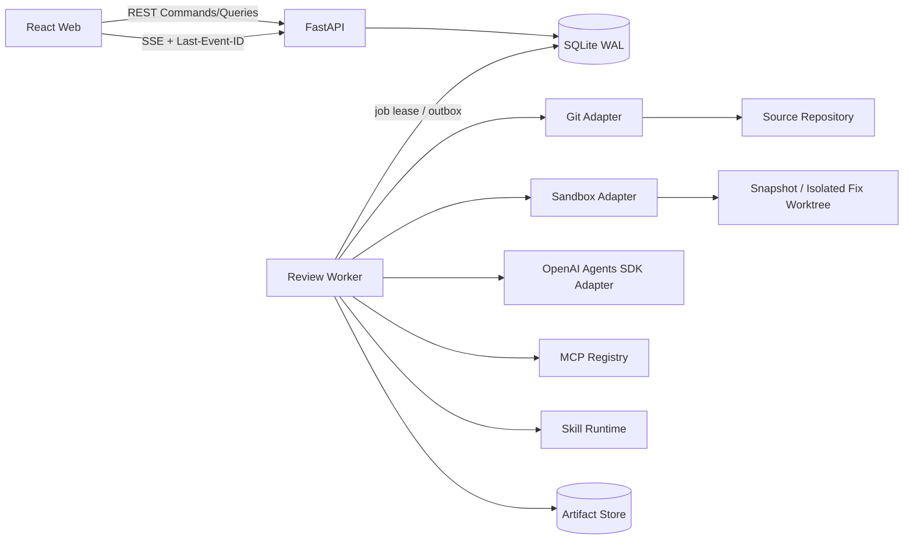
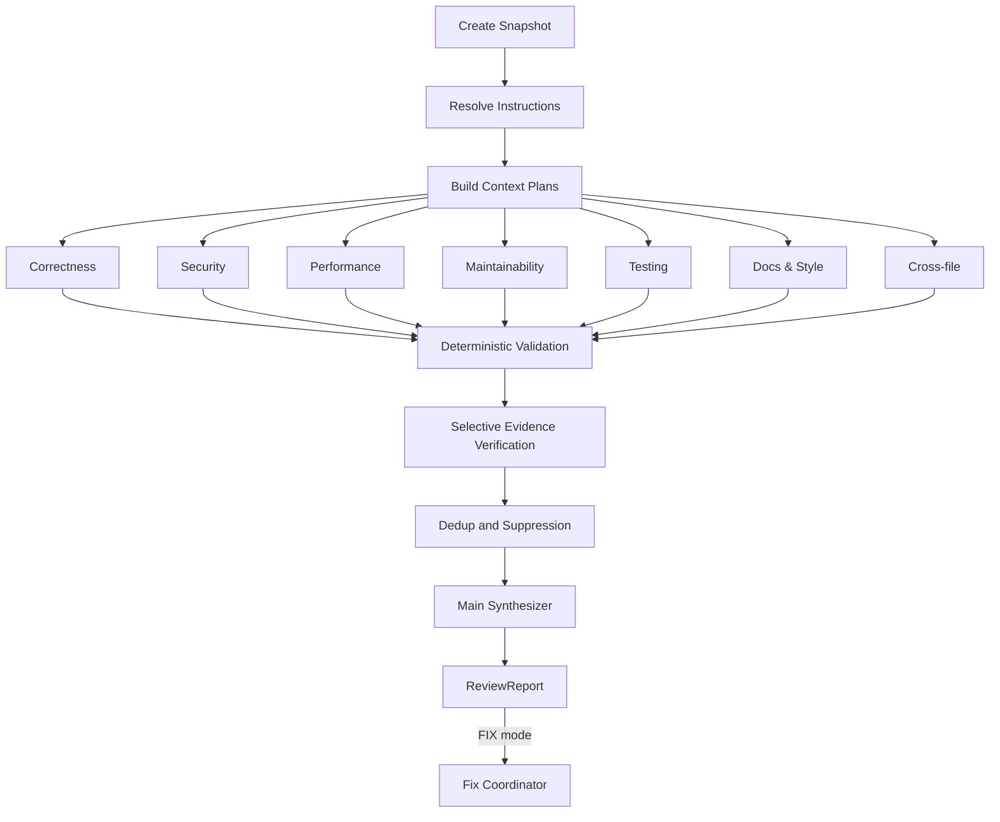

# CodeLens 本地多 Agent 代码 Review 应用设计

**状态：** 已确认  
**日期：** 2026-07-17  
**目标版本：** 本地/受信任内网部署的首个可用版本  
**技术基线：** Python 后端、React Web 前端、OpenAI Agents SDK、DDD 分层

## 1. 背景

前期参考资料形成了审查前移、七类专业 Reviewer、确定性上下文、证据验证、
分层门禁和持续评测等方法论。其有效内容已经合并到本设计，原始参考文件已删除，
不再作为项目依赖。

在方法论之外，应用还需要补齐以下工程约束：

1. 任务状态机、幂等性、取消和失败恢复。
2. Review 范围与不可变输入快照。
3. Agent、Skill、MCP 的版本和权限模型。
4. Finding 的结构化输出和证据约束。
5. Review/Fix 的物理隔离与补丁应用流程。
6. 本地 Web、内网访问、存储、API 和升级策略。
7. 可执行测试、评测集和发布门禁。

本设计将这些内容固化为一个可实施的产品规格。

## 2. 已确认的产品决策

1. 首版面向本地单机，也支持绑定 `0.0.0.0` 部署到受信任内网。
2. 首版不实现身份认证、用户、租户、计费和组织管理。
3. 前后端分离开发；发布时后端可以托管已构建的前端静态资源。
4. 外层工作流由 Python 确定性编排，OpenAI Agents SDK 只负责 Agent 节点执行。
5. 默认运行全部启用的 Review Agent，用户可以只勾选指定 Agent。
6. 主 Agent 负责对已校验 Finding 进行汇总，不得创造无来源 Finding。
7. Review 模式严格只读，严禁修改原仓库或代码快照。
8. Fix 模式只修改隔离副本，最终由应用校验并应用 PatchSet。
9. Fix 支持默认自动审批；任何硬门禁失败时自动降级为人工处理。
10. 所有 Review 范围都排除当前 `.gitignore` 规则命中的路径，包括已跟踪文件。
11. 根目录 `AGENTS.md`、根目录 `REVIEW.md`、目录级 `REVIEW.md` 和文件级规则都随快照冻结。
12. 首版允许 `0.0.0.0 + auth=none`，并明确将整个可达内网视为可信边界。

## 3. 目标与非目标

### 3.1 产品目标

- 从浏览器选择服务器本地 Git 仓库并启动 review。
- 支持四种范围：分支、指定 commit、未提交改动和全仓扫描。
- 支持独立配置和版本化多种 Reviewer Prompt。
- 支持默认全选和按需选择 Reviewer，并行运行选中的 Reviewer。
- 支持 OpenAI Agents SDK、Skills、MCP 和静态分析工具。
- 输出可定位、可验证、可去重、可反馈的结构化 Finding。
- 生成包含覆盖范围、Agent 状态、证据、风险和失败信息的总报告。
- 在 Fix 模式隔离修复，验证后人工或自动应用到源仓库。
- 在 Worker/API 重启后恢复未完成任务和浏览器事件流。
- 提供可衡量精度、信噪比、延迟、成本和修复成功率的 eval 体系。

### 3.2 首版非目标

- GitHub/GitLab PR App、Webhook 和 inline comment 发布。
- 多租户 SaaS、团队权限、SSO、RBAC 和计费。
- 移动端优先体验；移动端只保证状态查看和基本操作可用。
- 无人监管地修改源仓库以外的系统资源。
- 自动把单次用户反馈永久写入规则或 Prompt。
- 自研通用代码知识图谱；首版通过适配器复用 CodeGraph/MCP 或采用轻量 AST/文本检索。
- 承诺 AI 代替人工判断业务逻辑、架构方向和最终合并责任。

## 4. 总体架构

### 4.1 架构原则

1. **领域层无供应商依赖：** 不导入 OpenAI、Git、SQLite、FastAPI 或 MCP SDK。
2. **外层确定性编排：** 哪些 Agent 运行、并发数、超时、重试和完成条件由应用代码决定。
3. **快照一致性：** 一次任务中的所有 Agent 只读取同一个 `ReviewSnapshot`。
4. **能力最小化：** Agent 只能看到显式绑定的 Skill、MCP 工具和静态工具。
5. **证据优先：** Finding 必须关联快照路径、位置和可验证证据。
6. **失败显式化：** 部分成功不能伪装为完整成功。
7. **原仓库隔离：** 模型和沙箱永远不直接写入原仓库。
8. **可替换适配器：** 模型、沙箱、代码检索、MCP 和 Secret Store 均通过 Port 替换。

### 4.2 组件关系



### 4.3 OpenAI Agents SDK 的使用边界

Agents SDK 适合管理 Agent turns、tools、structured output、MCP、guardrails 和 tracing。官方文档同时支持 manager-style agents 和由 Python 代码控制并行编排。本应用采用后者作为顶层工作流，原因是必须保证用户勾选的 Agent 全部被调度，并且要独立展示状态、超时和失败。

- SDK 总览：<https://openai.github.io/openai-agents-python/>
- 多 Agent 编排：<https://openai.github.io/openai-agents-python/multi_agent/>
- MCP：<https://openai.github.io/openai-agents-python/mcp/>
- Sandbox Agents：<https://openai.github.io/openai-agents-python/sandbox_agents/>
- Guardrails：<https://openai.github.io/openai-agents-python/guardrails/>
- Tracing：<https://openai.github.io/openai-agents-python/tracing/>

Sandbox Agents 当前是 Beta，因此通过 `SandboxProvider`/`SkillRuntimePort` 接入，不让 Beta API 进入领域层。

## 5. DDD 限界上下文

### 5.1 Workspace

**职责：** 识别仓库、计算 Review 范围、应用 ignore 规则并创建不可变快照。

核心模型：

- `RepositoryId`
- `RepositoryDescriptor`
- `ReviewScope`
- `ReviewSnapshot`
- `SnapshotManifest`
- `ChangeIndex`
- `IgnorePolicy`

### 5.2 Review

**职责：** 管理 review 任务生命周期、预算、选中的 Agent 和完成策略。

聚合根：`ReviewTask`

主要属性：

- `task_id`
- `repository_id`
- `scope`
- `run_mode: REVIEW | FIX`
- `snapshot_id`
- `selected_agent_versions`
- `budget`
- `completion_policy`
- `status`
- `created_at / started_at / finished_at`

### 5.3 Reviewer Catalog

**职责：** 管理 Reviewer 身份、Prompt 版本、模型策略和能力绑定。

核心模型：

- `AgentDefinition`
- `AgentVersion`
- `ModelProfile`
- `AgentRunPolicy`
- `AgentCapabilityBinding`

### 5.4 Instruction Policy

**职责：** 发现、解析、排序和冻结适用于每个目标文件的 review 指令。

核心模型：

- `InstructionDocument`
- `InstructionSource`
- `ResolvedInstructionSet`
- `RuleReference`
- `StructuredSkipRule`

### 5.5 Finding & Report

**职责：** 校验、验证、去重、抑制和汇总 Reviewer 输出。

聚合根：`ReviewReport`

核心模型：

- `Finding`
- `Evidence`
- `SourceLocation`
- `FindingFingerprint`
- `FindingCluster`
- `CoverageSummary`

### 5.6 Change Proposal

**职责：** 基于 Finding 创建隔离修复、验证补丁和安全应用。

聚合根：`FixTask`

核心模型：

- `FixSelection`
- `PatchSet`
- `ValidationGate`
- `ApprovalPolicy`
- `RepositoryFingerprint`
- `ApplyResult`

### 5.7 Capability Catalog

**职责：** 管理 Skill、MCP、静态工具及其信任状态。

核心模型：

- `SkillDefinition / SkillVersion`
- `McpServerDefinition`
- `McpToolPolicy`
- `StaticToolDefinition`
- `RepositoryTrust`

### 5.8 Governance

**职责：** 保存版本、审计、反馈和评测结果，不直接改变运行规则。

核心模型：

- `Feedback`
- `Suppression`
- `PromptEvaluation`
- `RuleProposal`
- `AuditEvent`

## 6. Review 范围和快照

### 6.1 四种 ReviewScope

#### 分支 Diff + 未提交改动

```text
base = merge-base(base_branch, HEAD)
target = current WORKTREE
range = base -> target
```

包含当前分支在 merge-base 之后的提交，以及 staged、unstaged 和未被忽略的 untracked 文件。

#### 指定 Commit + 未提交改动

```text
base = selected commit
target = current WORKTREE
range = base -> target
```

指定 commit 是基线，而不是只审查该 commit 自身。若 commit 不是当前 HEAD 的祖先，允许使用 direct diff，但创建任务前必须显示非祖先警告。

#### 仅未提交改动

```text
base = HEAD
target = current WORKTREE
range = HEAD -> target
```

包含 staged、unstaged 和未被忽略的 untracked 文件。

#### 全仓扫描

目标是当前 WORKTREE 中符合 include/ignore/safety 策略的全部文件。扫描按模块分片，不把整个仓库一次性发送给模型。

### 6.2 `.gitignore` 语义

所有范围都必须经过统一 `IgnorePolicy`：

1. 使用 Git 自身的 ignore 解析能力，不自研 glob 语义。
2. 递归支持仓库各级 `.gitignore`。
3. 遵循规则顺序、目录作用域和 `!` 反选。
4. 使用 no-index 语义判断已跟踪文件是否命中 ignore。
5. 命中的已跟踪文件同样从 review 候选集排除。
6. Manifest 保存每个 excluded path 对应的规则文件、行号和 pattern。
7. UI 展示 included、ignored、policy excluded、binary 和 oversized 数量。

`ReviewSnapshot` 明确区分两类文件：

- `target_paths`：由 ReviewScope 选出的实际审查目标，决定 changed hunk、覆盖率和 Finding 变更归因。
- `context_paths`：允许 Agent 只读检索的未变更调用方、测试、接口和配置，用于理解目标代码。

两类路径都必须经过相同的 `.gitignore`、structured skip 和 safety filter。非全仓模式下，context path 不自动变成 review target；Reviewer 对 context path 发现的问题只能作为 related location，除非能够证明该问题由 target change 引入或暴露。

实现应调用等价于以下 Git 能力，并使用参数数组而非 shell 字符串：

```text
git check-ignore --no-index -v --stdin
```

### 6.3 Snapshot 创建

创建过程：

1. 校验 repository realpath、Git 状态、HEAD 和基线引用。
2. 计算 HEAD SHA、index tree/hash、工作区候选文件哈希。
3. 计算原始候选集并应用 `.gitignore`、结构化 skip 和 safety filter。
4. 在任务目录物化当前工作区视图；Review 模式不向 Agent 暴露原仓库路径。
5. 创建 changed hunks、rename、delete、binary 和 untracked 的 `ChangeIndex`。
6. 冻结规则文件、AgentVersion、SkillVersion、MCP binding、ModelProfile 和预算。
7. 再次计算源工作区指纹；若变化则重试一次，仍变化则以 `SNAPSHOT_STALE` 失败。

快照必须记录：

- `snapshot_id`
- `repository_realpath_hash`
- `base_revision`
- `head_revision`
- `index_hash`
- `worktree_hash`
- `manifest_hash`
- `created_at`
- `included_files[]`
- `target_paths[]`
- `context_paths[]`
- `excluded_files[] + reason`

### 6.4 特殊文件策略

- 二进制：不发送正文，只保存元数据和变更类型。
- Git LFS pointer：保存 pointer 信息，并默认不自动拉取大对象。
- 超大文件：超过配置阈值时只提供相关 hunk 和索引摘要。
- Symlink：拒绝解析到 repository realpath 之外的目标。
- Submodule：首版保存 SHA 变化；除非用户显式开启，不递归扫描子模块。
- 生成文件：由 `.gitignore`、REVIEW skip 或用户排除规则控制。

## 7. 指令解析

### 7.1 文件发现和优先级

对目标文件 `src/payments/api/payment.py`，解析顺序为：

1. 平台不可覆盖约束，单独注入，仓库规则不能覆盖。
2. Reviewer 的职责和 Prompt。
3. `/AGENTS.md`。
4. `/REVIEW.md`。
5. `/src/REVIEW.md`。
6. `/src/payments/REVIEW.md`。
7. `/src/payments/api/REVIEW.md`。
8. `/src/payments/api/payment.py.review.md`。

文件级规则使用完整文件名加 `.review.md`，避免 `payment.py`、`payment.ts` 和 `payment.test.py` 共享同一个含糊规则文件。

首版只把根 `AGENTS.md` 作为必选规则源。目录级覆盖由 `REVIEW.md` 承担；嵌套 `AGENTS.md` 不属于首版规则链。

规则发现与 review 候选文件过滤是两条独立流程。根 `AGENTS.md`、适用的 `REVIEW.md` 和文件级 `.review.md` 属于控制输入，只要文件存在就按上述规则加载，即使规则文件自身命中 `.gitignore`。`.gitignore` 只决定哪些目标代码/文档进入 review 范围，不能关闭控制规则。

### 7.2 冲突语义

- 平台只读、路径、输出 schema、能力和证据规则永远不可覆盖。
- Reviewer 的专业职责不可被仓库规则取消，但仓库规则可以增加检查项或排除业务无关噪声。
- 在仓库规则之间，距离目标文件更近的规则覆盖更宽泛的规则。
- 同一文件中靠后的明确规则优先，但应用保留完整原文和来源供模型理解。
- 主 Agent 和 UI 必须能够展示 Finding 命中的规则来源。

### 7.3 REVIEW.md 结构化部分

Markdown 正文作为模型指令。为实现确定性 include/skip，可使用 YAML frontmatter：

```yaml
---
include:
  - "src/**"
exclude:
  - "src/generated/**"
agents:
  - security
  - correctness
severity_floor: medium
---
```

同时兼容文档中已有的 `## Skip` 写法：使用 Markdown AST 读取该标题下的列表；只有可以规范化为仓库相对 glob/path 的条目才进入确定性 skip，其余条目保留为 Prompt 并产生配置警告。不得用不受约束的字符串切割解析 Markdown。

## 8. Reviewer 与 Agent 编排

### 8.1 内置 Reviewer

首版提供以下默认启用的 Agent：

1. `correctness`：逻辑、边界、异常、并发和状态机。
2. `security`：鉴权、授权、注入、秘密、数据暴露和供应链。
3. `performance`：复杂度、N+1、阻塞、内存和资源使用。
4. `maintainability`：职责、耦合、重复、契约和可测试性。
5. `testing`：回归风险、边界用例、失败路径和测试质量。
6. `docs_style`：公开契约、文档、命名和仓库约定。
7. `cross_file`：调用链、导入、接口兼容和上下游影响。

以下是系统节点，不出现在用户勾选列表：

- `evidence_verifier`
- `review_synthesizer`
- `fix_agent`

### 8.2 AgentDefinition

每次编辑创建不可变 `AgentVersion`，运行中的任务继续引用旧版本。

```text
AgentDefinition
  id
  name
  description
  enabled_by_default
  active_version_id

AgentVersion
  agent_id
  version
  prompt_template
  model_profile_id
  output_schema_version
  timeout_seconds
  max_turns
  token_budget
  confidence_floor
  failure_policy
  mode_support
  skill_bindings[]
  mcp_bindings[]
  static_tool_bindings[]
  content_hash
```

`ModelProfile` 持有模型 ID、reasoning 设置、输出限制和重试策略。模型 ID 是发布配置，不进入领域规则；每次正式发布应固定通过 eval 的模型快照或明确版本，避免无评测地跟随浮动别名。

### 8.3 确定性 DAG



并发通过 `asyncio` 和 semaphore 控制。默认 Agent 并发上限为 4，可配置但不能超过模型、MCP 和本机资源限制。

### 8.4 完成策略

- 全部选中 Agent 成功：`COMPLETED`。
- 至少一个成功且至少一个失败：`PARTIAL`，仍生成报告。
- 全部失败：`FAILED`，不运行主 Agent。
- 主 Agent 失败：使用确定性模板按 severity/confidence 输出降级报告。
- 用户取消：`CANCELED`，不启动新节点并终止当前子进程。

## 9. 上下文工程

### 9.1 ContextPlan

每个 Agent 获得独立、可审计的 `ContextPlan`：

1. Review task 和 Agent 目标。
2. 适用的 ResolvedInstructionSet。
3. 变更 diff 和 changed hunks。
4. 变更符号的完整定义。
5. 按需检索的 caller、callee、接口、测试和配置。
6. 与 Agent 绑定的 MCP 业务上下文。
7. 静态工具输出和命令证据。
8. 明确的 token 预算和截断记录。

ContextPlan 中每个片段记录：

- 来源类型和 URI/path。
- snapshot/hash。
- 与变更的关联原因。
- token 估算。
- 是否包含敏感数据。

### 9.2 检索适配器

优先级：

1. 仓库存在 `.codegraph/` 时调用 CodeGraph。
2. 配置了 codebase-memory/code graph MCP 时使用其只读工具。
3. 否则使用 tree-sitter/LSP 能力构建变更符号邻域。
4. 字符串、配置和兜底搜索使用 ripgrep。

该优先级封装在 `CodeContextProvider` Port 中，不进入 Reviewer Prompt。

### 9.3 全仓扫描

1. 按语言、模块和依赖边界建立 shard。
2. 每个 shard 运行适用 Reviewer。
3. shard 内先校验和去重。
4. 汇总层只接收压缩后的 FindingBatch 和跨 shard 索引。
5. Cross-file Agent 对高风险边界做第二轮定向检查。
6. 达到预算上限时报告未覆盖 shard，不能声称全仓完成。

## 10. Finding 输出契约

Reviewer 的 `output_type` 必须是版本化 Pydantic schema，而不是 Markdown 文本。

```python
class Finding:
    id: str
    reviewer_id: str
    category: str
    title: str
    severity: Literal["critical", "high", "medium", "low", "info"]
    disposition: Literal["blocking", "non_blocking", "pre_existing"]
    confidence: float
    primary_location: SourceLocation
    related_locations: list[SourceLocation]
    changed_hunk_id: str | None
    change_origin: Literal["introduced", "exposed", "pre_existing", "unknown"]
    evidence: list[Evidence]
    impact: str
    explanation: str
    reproduction: str | None
    recommendation: str
    suggested_patch: str | None
    rule_sources: list[RuleReference]
    fingerprint: str
```

### 10.1 确定性校验

- path 必须存在于 SnapshotManifest，或明确标记为 deleted path。
- realpath 不得越过 snapshot root。
- 行号必须存在且与对应 side 匹配。
- excerpt hash 必须与 snapshot 内容一致。
- Finding 必须关联 changed hunk，或声明 related unchanged location 和变更传播关系。
- confidence 必须在 `[0, 1]`。
- 不符合 schema 时允许一次结构化修复；再次失败则隔离该 AgentRun 输出。

### 10.2 Evidence Verifier

不是每个 Finding 都启动新 Agent。以下候选进入验证：

- `critical/high`。
- blocking Finding。
- confidence 低于 Agent 高置信阈值但高于报告阈值。
- 多 Agent 对同一位置得出冲突结论。
- 需要 test/lint/static tool 才能确认的 Finding。

验证结果可以确认、降低置信度、降级 severity 或拒绝 Finding，但必须保存理由和证据。

### 10.3 去重和主 Agent约束

- 首先按稳定 fingerprint 去重。
- 再按 category、位置、数据流和语义相似度聚类。
- 主 Agent 只能引用已校验 Finding ID 做排序、归并、摘要和风险热点分析。
- 主 Agent 不能新增 Finding；若发现潜在新问题，记录为 `synthesis_note`，不计入问题列表。
- severity 上调必须由 Evidence Verifier 确认；主 Agent可以降级但必须说明原因。

## 11. Skill 支持

### 11.1 存储位置

- 应用内置：`<package>/builtin_skills/`
- 用户安装：`<app_data>/skills/`
- 仓库提供：`<repository>/.codelens/skills/`

Skill 使用 `SKILL.md`、references 和可选 scripts。仓库 Skill 默认不可信，只有在 RepositoryTrust 明确允许后才能加载。

### 11.2 SkillVersion

保存：

- name/description。
- content hash/version。
- source 和 trust level。
- 支持的 run mode。
- 需要的工具和网络能力。
- 入口文件和可执行脚本 manifest。

Skill 按 Agent lazy load，只物化绑定且实际需要的 Skill。Skill 文本不能提升权限；scripts 只能在 Sandbox 和命令 allowlist 下执行。

## 12. MCP 支持

首版支持：

- `stdio`
- `Streamable HTTP`

SSE transport 仅作为兼容旧服务的非默认扩展，不用于新配置。

`McpServerDefinition` 保存：

- name/transport。
- command + args 或 URL。
- environment secret references。
- connect/read timeout。
- retry policy。
- allowed_tools/blocked_tools。
- approval policy。
- trust state。

要求：

1. 每个 Agent 独立绑定 MCP 和 tool allowlist。
2. UI 必须支持 list tools、健康检查和样例调用。
3. token 只保存到 SecretStore，SQLite 只保存引用。
4. MCP 输出视为不可信数据，不能改变平台权限。
5. Review 模式默认只允许无副作用工具。
6. 外部写入、删除或发布工具必须人工批准；Fix 自动审批不自动批准 MCP 外部副作用。
7. MCP 不可用只影响绑定它的 Agent，除非 Agent 将该 MCP 声明为 required。

## 13. 权限与 Sandbox

### 13.1 REVIEW 模式

- Agent 看到物化 Snapshot，挂载为只读。
- 可写目录只有任务临时目录。
- 原仓库不挂载到 Sandbox。
- 网络默认关闭。
- tests、lint、build 和 SAST 必须匹配命令模板。
- 未安装容器运行时时，静态 review 仍可运行；仓库命令需要显式信任并启用 `LocalExecutor`。

### 13.2 FIX 模式

- GitAdapter 在主机创建隔离临时 worktree。
- Sandbox 只挂载 worktree 内容，屏蔽或不挂载指向原仓库的 `.git` 元数据。
- Agent 可修改隔离副本，但不能访问原工作区路径。
- GitAdapter 在 Sandbox 外生成 Snapshot-to-Fix PatchSet。
- 模型无权直接执行 PatchSet 到原仓库。

### 13.3 容器限制

- 无宿主 Docker socket。
- 不注入宿主 SSH、Git、云或 OpenAI 凭据。
- 默认无网；MCP 由受控适配器调用。
- CPU、memory、PID、disk、command timeout 和 output size 限制。
- 所有子进程属于可统一终止的 process group。
- 清理失败的任务目录进入 quarantine，并在下次启动重试。

### 13.4 Prompt Injection

- 代码、注释、README、规则文件和 MCP 输出全部标记为不可信内容。
- 能力授权由 Enforcer 执行，不能依赖 Prompt 拒绝。
- 文件工具强制 realpath containment。
- 命令工具使用参数数组和模板校验，不使用 `shell=True`。
- 工具返回值不携带未脱敏 secret。
- 输出必须通过 schema 和 evidence 校验。

## 14. Fix 工作流

### 14.1 进入 Fix 的方式

1. 从 ReviewReport 选择一个或多个 Finding 创建 FixTask。
2. 创建任务时直接选择 Fix 模式；默认修复 `blocking` 和 `high` 且 `change_origin=introduced` 的 actionable Finding，用户可以修改 severity 范围。

### 14.2 Fix 状态机

```text
CREATED
  -> PREPARING_WORKTREE
  -> FIXING
  -> VERIFYING
  -> AWAITING_APPROVAL | AUTO_APPLYING
  -> APPLIED

任意运行态 -> CANCELED | FIX_FAILED
应用冲突 -> APPLY_CONFLICT
```

### 14.3 自动审批硬门禁

即使用户开启默认审批，只有全部满足才可自动应用：

1. 源仓库 HEAD、index 和 worktree fingerprint 与 Snapshot 创建时一致。
2. PatchSet 只修改 FixTask allowlist 中的文件。
3. PatchSet 不包含仓库外路径、非法 symlink 或不允许的 binary change。
4. 配置为 required 的 test/lint/build/security gate 全部通过。
5. Secret scan 未发现新增 secret。
6. PatchSet 文件数和行数不超过自动应用阈值。
7. `git apply --3way --check` 或等价检查无冲突。

任何门禁失败都不能自动覆盖源仓库，而是保存 PatchSet、证据和失败原因，并进入人工处理。

### 14.4 应用语义

- 默认把补丁应用到当前工作区，不自动 commit。
- 应用操作必须幂等；重复请求返回已完成结果。
- 应用前后保存 RepositoryFingerprint。
- 若部分应用发生异常，立即停止并报告；不得自动 reset 用户仓库。
- 应用成功后可选择启动一个新的 `仅未提交改动` ReviewTask 验证结果。

## 15. 任务状态与持久执行

### 15.1 ReviewTask 状态机

```text
CREATED
  -> SNAPSHOTTING
  -> PREPARING
  -> REVIEWING
  -> VALIDATING
  -> SYNTHESIZING
  -> COMPLETED | PARTIAL

任意运行态 -> CANCELED | FAILED
```

状态转换由领域方法验证，API 和 Worker 不能直接写任意状态。

### 15.2 AgentRun 状态

```text
PENDING | RUNNING | SUCCEEDED | FAILED | TIMED_OUT | CANCELED | SKIPPED
```

### 15.3 Worker lease

- FastAPI 只创建任务和查询状态，不在请求进程运行长任务。
- 独立 Worker 用 SQLite transaction 领取 job lease。
- Worker 持续写 heartbeat。
- lease 超时后其他 Worker 可以重新领取。
- 每个 DAG node 使用稳定 idempotency key。
- 已成功节点不会因进程重启重复产生 Finding。
- API/Worker 单机可由一个 Supervisor 统一启动和停止。

### 15.4 SSE outbox

- 所有用户可见状态变化先在同一 SQLite transaction 写入 `events`。
- SSE 按递增 event ID 推送。
- 浏览器使用 `Last-Event-ID` 断线续传。
- 大日志只发送摘要和 artifact reference。

## 16. 数据存储

SQLite 使用 WAL 和 Alembic migration。主要表：

- `repositories`
- `review_tasks`
- `review_snapshots`
- `agent_definitions`
- `agent_versions`
- `agent_runs`
- `instruction_documents`
- `findings`
- `finding_evidence`
- `review_reports`
- `fix_tasks`
- `patch_sets`
- `validation_runs`
- `skills / skill_versions`
- `mcp_servers`
- `capability_bindings`
- `feedback / suppressions`
- `jobs / job_leases`
- `events`
- `artifacts`
- `settings`

Snapshot、完整日志、Patch、测试输出等大对象保存到 Artifact Store，SQLite 只保存 metadata、hash 和相对路径。

默认 retention：

- Snapshot 和原始 Agent 输出：30 天。
- 报告、Finding、Prompt/规则版本和 eval 结果：保留直到用户删除。
- 临时 worktree：任务结束后立即清理；失败则 quarantine 后重试。
- UI 支持按任务删除和清空全部本地数据。

## 17. HTTP API

### 17.1 Repository 和 Review

```text
POST /api/repositories/inspect
POST /api/reviews
GET  /api/reviews/{id}
GET  /api/reviews/{id}/events
POST /api/reviews/{id}/cancel
GET  /api/reviews/{id}/report
```

创建任务示例：

```json
{
  "repository_path": "/srv/repos/billing-service",
  "scope": {
    "type": "branch",
    "base_branch": "origin/main"
  },
  "mode": "review",
  "agent_ids": [
    "correctness",
    "security",
    "performance",
    "maintainability",
    "testing",
    "docs_style",
    "cross_file"
  ],
  "command_profile_id": "python-default",
  "budget_profile_id": "balanced"
}
```

### 17.2 Fix

```text
POST /api/reviews/{id}/fixes
GET  /api/fixes/{id}
GET  /api/fixes/{id}/patch
POST /api/fixes/{id}/apply
POST /api/fixes/{id}/cancel
```

### 17.3 配置

```text
GET/POST/PUT /api/agents
GET/POST/PUT /api/model-profiles
GET/POST/PUT /api/skills
GET/POST/PUT /api/mcp-servers
POST         /api/mcp-servers/{id}/check
GET/PUT      /api/settings
POST         /api/findings/{id}/feedback
POST/DELETE  /api/suppressions
```

API 使用 Pydantic DTO，不直接序列化领域实体。Commands 和 Queries 在应用层分离，但首版不引入独立 CQRS 基础设施。

## 18. Web 信息架构

### 18.1 导航

- 新建 Review
- 运行记录
- 基准评测
- Review Agents
- Skills
- MCP Servers
- 模型配置
- 系统设置

### 18.2 新建 Review

- 服务端仓库路径和最近仓库。
- Review/Fix mode segmented control。
- 四种范围及动态 branch/commit selector。
- `.gitignore` 和 policy 排除预览。
- Agent 全选/单选及健康状态。
- tests/lint/build 命令 profile。
- 数据目的地和预计 token/耗时。
- Fix selection、默认审批状态和硬门禁摘要。
- 启动按钮。

### 18.3 运行详情

固定视图：

- Overview
- Findings
- Diff
- Agent Runs
- Artifacts

Findings 支持按 severity、category、confidence、origin、Agent、文件和 disposition 过滤。详情面板显示：

- 代码位置和 diff。
- 影响和解释。
- Evidence 和 artifact。
- 命中规则来源。
- 验证结果。
- 修复、忽略和 suppression 操作。

### 18.4 Agent 编辑器

- Prompt 编辑和版本差异。
- ModelProfile、budget、timeout、confidence floor。
- Skill/MCP/static tool 绑定。
- 输出 schema 版本。
- 用 fixture repository 做样例试跑。
- 回滚到历史版本。

## 19. 本机与内网部署

### 19.1 启动方式

```bash
pipx install codelens-review
codelens-review start .
```

受信任内网：

```bash
codelens-review start /srv/repos \
  --host 0.0.0.0 \
  --port 8765 \
  --auth none
```

配置：

```toml
[server]
host = "0.0.0.0"
port = 8765
auth = "none"
repository_roots = ["/srv/repos"]
allowed_hosts = ["10.0.1.20", "review.intra.example"]
allowed_origins = [
  "http://10.0.1.20:8765",
  "http://review.intra.example:8765"
]
```

### 19.2 无鉴权模式的明确边界

`0.0.0.0 + auth=none` 意味着任何能访问服务端口的用户都可以：

- 查看服务器仓库的 review 结果。
- 发起模型调用并消耗配额。
- 访问 Artifact。
- 在 Fix/自动审批允许时修改服务器工作区。

首版允许该部署方式，但 UI 和启动日志必须持续显示无鉴权内网模式。该模式不是安全的互联网或不可信多用户部署。

受信任内网模式必须配置至少一个 `repository_roots`。Repository inspect、Snapshot 和 Fix apply 只接受 realpath 位于这些根目录下的 Git 仓库；API 不接受任意服务器文件路径。Artifact 下载只使用不可猜测的 artifact ID 和数据库映射，不接收文件系统路径。

即使不鉴权，仍执行：

- Host allowlist，防 DNS rebinding。
- Origin allowlist 和关闭宽泛 CORS。
- JSON content type，拒绝 form POST 到命令接口。
- OpenAI/MCP secret 只保留在服务端。
- 来源 IP、User-Agent 和操作审计。
- Sandbox 网络和文件权限不因 HTTP bind 放宽。

远程浏览器选择的是服务器路径，不访问浏览器所在电脑的本地磁盘。

## 20. Secret、隐私与 Tracing

- API key 和 MCP token 优先保存到系统 Secret Store；SQLite 只保存引用。
- 环境变量作为无 Secret Store 环境下的兼容方式。
- 日志和 Artifact 写入前进行 secret redaction。
- 创建任务页显示将发送到 OpenAI 和远程 MCP 的数据类别。
- 支持路径级禁止外发规则。
- 本地运行不代表代码不出机；这一点必须在 UI 明确披露。
- Agents SDK tracing 默认设置 `trace_include_sensitive_data=False`。
- ZDR 或用户禁用 tracing 时，不向 OpenAI trace backend 发送 trace。
- 自定义 trace processor 可以写入本地 OpenTelemetry/日志系统。
- RunContext 不放置 secret，避免随暂停状态持久化。

## 21. 错误处理

| 场景 | 行为 |
|---|---|
| 仓库无效或基线不存在 | 创建任务前返回可操作错误 |
| 快照期间仓库变化 | 重试一次，之后 `SNAPSHOT_STALE` |
| 没有选择 Agent | 拒绝创建任务 |
| 模型限流/网络超时 | 指数退避并执行节点级幂等重试 |
| 模型拒绝或 invalid output | 使用 SDK error handler；结构修复一次 |
| MCP 连接失败 | 标记依赖 Agent 失败或降级 |
| Sandbox 不可用 | 静态 review 可继续；命令型 Agent 明确跳过 |
| 单个 Agent 超时 | `TIMED_OUT`，报告进入 PARTIAL |
| 主 Agent 失败 | 确定性模板生成降级报告 |
| Worker 崩溃 | lease 超时后恢复未完成节点 |
| 用户取消 | 停止新节点并终止当前工具/子进程 |
| Fix gate 失败 | 保存 PatchSet，不自动应用 |
| 源仓库变化 | `APPLY_CONFLICT`，不覆盖用户修改 |
| 清理失败 | quarantine 并在下次启动重试 |

错误分为：领域错误、用户输入错误、依赖暂时错误、依赖永久错误、模型行为错误和安全策略错误。API 返回稳定错误码，模型原始错误只进入脱敏日志。

## 22. 性能与成本

- Agent 并发默认 4，并为模型、MCP、命令工具设置独立 semaphore。
- Context Builder 先 diff 后邻域，禁止无条件全仓 prompt。
- Snapshot 内容按 hash 去重存储或复用只读 cache。
- Agent 结果缓存键包含 snapshot、AgentVersion、InstructionSet、ModelProfile、SkillVersion 和工具版本。
- 使用动态 MCP 数据的 AgentRun 默认不可复用缓存，除非 MCP 响应有稳定版本标识。
- 共享代码索引可以跨 Agent 复用，但每个 Agent 的 Prompt/context 独立，避免结论污染。
- 达到预算上限时停止扩展上下文，报告覆盖缺口。
- UI 展示每个 Agent 的输入/输出 token、耗时、模型和工具调用数。

## 23. 反馈与持续学习

用户可以对 Finding：

- 接受。
- 忽略一次。
- 标记误报。
- 创建 suppression。
- 提交规则建议。

反馈不会直接修改 Prompt。系统定期把重复反馈聚合为 `RuleProposal`，由用户确认后生成新的 REVIEW.md 建议或 AgentVersion。这样避免恶意仓库、偶然操作和单次偏好污染长期规则。

## 24. 测试与 Eval

### 24.1 单元测试

- ReviewScope 计算。
- `.gitignore` 和 `!` 反选。
- 目录规则和文件规则优先级。
- ReviewTask/FixTask 状态机。
- Finding schema 和 fingerprint。
- 自动审批硬门禁。
- path containment 和 command policy。

### 24.2 Git 集成测试

使用临时仓库覆盖：

- staged/unstaged/untracked。
- rename/delete/binary。
- branch merge-base。
- commit 非祖先。
- nested `.gitignore`。
- tracked ignored file。
- symlink escape。
- submodule SHA 更新。
- Snapshot 期间并发修改。

### 24.3 Adapter 契约测试

- OpenAI AgentRuntime。
- GitAdapter。
- SandboxProvider。
- MCP Registry。
- Skill Runtime。
- Secret Store。
- CodeContextProvider。

外部依赖测试使用 record/replay fixture，但必须保留少量受控 live smoke test。

### 24.4 Worker 和 E2E

- 并行上限和公平调度。
- 重试、取消、lease 和崩溃恢复。
- PARTIAL/FAILED 降级。
- SSE 断线续传。
- Playwright 覆盖创建 review、finding、fix、自动审批、冲突和恢复。

### 24.5 安全测试

- 路径穿越和 symlink。
- Git/command 参数注入。
- 恶意代码注释和 README 指令。
- 恶意 Skill/MCP output。
- DNS rebinding、Host/Origin 和 CORS。
- secret 泄露到日志、trace、RunContext 和浏览器。

### 24.6 Review 质量 Eval

内部 golden 数据集至少包含：

- 已知 bug 的真实 PR/diff。
- 无问题或纯重构变更。
- 安全、并发、性能、测试和跨文件问题。
- 不应报告的 pre-existing/低价值问题。
- 多语言仓库样本。

核心指标：

- precision、recall、precision@k。
- location accuracy。
- evidence validity。
- actionable rate 和用户接受率。
- false positive rate 和 SNR。
- fix apply/test success rate。
- p50/p95 latency。
- 每次任务和每个有效 Finding 的成本。

可执行 oracle 和人工 golden Finding 是主要判据；LLM-as-a-Judge 只用于语义等价和表达质量的辅助评估。每次修改 Prompt、模型、规则合并和验证阈值都必须跑回归 eval。

## 25. 推荐工程结构

```text
CodeLens/
  backend/
    pyproject.toml
    src/codelens/
      bootstrap/
      shared/
      workspace/
        domain/
        application/
        infrastructure/
      review/
        domain/
        application/
        infrastructure/
      reviewer_catalog/
      instruction_policy/
      findings/
      change_proposal/
      capabilities/
      governance/
      interface/http/
      worker/
    tests/
      unit/
      integration/
      contract/
      evals/
  frontend/
    src/
      app/
      features/repositories/
      features/reviews/
      features/findings/
      features/agents/
      features/capabilities/
      features/settings/
      shared/
    e2e/
  builtin_skills/
  evals/
    datasets/
    fixtures/
    reports/
  docs/
    adr/
    superpowers/specs/
```

建议技术组件：

- Python 3.12。
- FastAPI、Pydantic v2、SQLAlchemy 2、Alembic。
- OpenAI Agents SDK。
- `asyncio.create_subprocess_exec` 调用 Git 和命令工具。
- SQLite WAL。
- React、TypeScript、Vite、TanStack Query、React Router。
- Monaco Diff Editor 或等价成熟 diff 组件。
- pytest、Playwright 和容器集成测试。
- `pipx`/`uv tool` 安装，发布包内附带构建后的前端资源。

## 26. 分阶段落地

本文件是项目级总体设计，不对应一个超大实施计划。实施时按下列阶段拆成独立计划和验收周期：首个实施计划只覆盖阶段 0–2，形成从仓库快照到单 Agent Finding 的完整纵向切片；阶段 3–7 在前一阶段验收后分别编写计划。后续计划必须引用本设计中的领域契约，不能重新定义范围、权限或 Finding 语义。

### 阶段 0：工程与决策基线

交付：

- 初始化 Git 仓库、Python/React workspace 和 CI。
- 建立 lint、format、type check、unit test 和 frontend build。
- 写入本设计和关键 ADR。
- 定义稳定错误码和领域事件规范。

验收：干净环境一条命令启动后端和前端；CI 可复现。

### 阶段 1：Repository/Snapshot 纵向切片

交付：

- 仓库 inspect。
- 四种 ReviewScope。
- Git 原生 `.gitignore` 过滤。
- SnapshotManifest 和 ChangeIndex。
- 根/目录/文件规则解析。
- UI 范围预览和 diff 浏览。

验收：临时 Git fixture 覆盖四种范围和 ignore 边界，源仓库不被修改。

### 阶段 2：单 Agent Review MVP

交付：

- OpenAI AgentRuntime adapter。
- AgentDefinition/AgentVersion/ModelProfile。
- 一个 Correctness Reviewer。
- Pydantic FindingBatch。
- ReviewTask/AgentRun、Worker lease、SSE。

验收：浏览器能创建任务、观察状态并获得有位置和证据的 Finding。

### 阶段 3：多 Agent 和汇总

交付：

- 七个内置 Reviewer。
- 默认全选和用户勾选。
- 并行、超时、重试、取消和 PARTIAL。
- Evidence Verifier、去重、suppression 和主 Agent 汇总。
- Agent/usage/coverage UI。

验收：选中的 Agent 均被调度；单 Agent 故障不会丢失其他结果；主 Agent 不产生无来源 Finding。

### 阶段 4：Skill、MCP 和上下文扩展

交付：

- Skill Catalog、信任和 lazy load。
- stdio/Streamable HTTP MCP。
- Agent tool allowlist。
- CodeContextProvider 适配器。
- repository trust 和命令 profile。

验收：不同 Agent 只能看到自己的能力；恶意 Skill/MCP 不能越权。

### 阶段 5：Fix 模式

交付：

- 隔离 worktree。
- Fix Agent 和 PatchSet。
- ValidationGate。
- 人工 apply 和默认自动审批。
- fingerprint、3-way check 和 APPLY_CONFLICT。

验收：Review 模式零写入；Fix 失败不改变原仓库；自动 apply 只在全部门禁通过时发生。

### 阶段 6：部署与安全加固

交付：

- Docker/Podman Sandbox。
- LocalExecutor 降级模式。
- SecretStore 和 redaction。
- Artifact retention。
- `127.0.0.1` 与 `0.0.0.0 auth=none` 配置。
- pipx/uv tool 跨平台发布包。

验收：本机和受信任内网均可访问；Host/Origin/security tests 通过；发布包无需前端开发工具即可运行。

### 阶段 7：质量评测和发布门禁

交付：

- golden eval 数据集。
- 回归 runner 和报告。
- Prompt/模型版本对比。
- precision/SNR/cost/latency dashboard。
- 发布阈值和回滚流程。

验收：任一 Prompt、模型或验证策略变更必须附带 eval 差异报告。

## 27. 风险与缓解

| 风险 | 缓解 |
|---|---|
| 多 Agent 成本随数量线性增长 | 上下文复用、节点预算、并发限制、选择 Agent、缓存 |
| 全仓扫描超出上下文 | shard、分层汇总、覆盖缺口报告 |
| Prompt Injection | 能力 Enforcer、Sandbox、schema/evidence 校验 |
| 误报导致用户失去信任 | confidence floor、证据验证、去重、suppression、eval |
| 自动 Fix 覆盖用户修改 | fingerprint、硬门禁、3-way check、失败关闭 |
| 仓库命令执行恶意代码 | 容器、无网、无凭据、resource limit、trust gate |
| 无鉴权内网访问被滥用 | 显式配置、持续警告、Host/Origin、审计、可信网络边界 |
| OpenAI/MCP 数据外发 | 数据目的地披露、路径排除、redaction、retention |
| SDK Beta API 变化 | Port/Adapter 隔离、版本锁定、契约测试 |
| 规则持续腐化 | 规则来源可见、命中统计、RuleProposal 人工确认 |

## 28. Definition of Done

首个可用版本只有在以下条件全部满足时才算完成：

1. 四种范围语义经过 Git fixture 验证。
2. 所有范围均排除 `.gitignore` 命中路径，包括 tracked file。
3. 规则链按本设计解析并在 UI 展示来源。
4. 用户选中的所有 Agent 被确定性调度。
5. Finding 通过 schema、路径、位置和 evidence 校验。
6. 主 Agent 报告中的问题全部可以追溯到 Finding ID。
7. 单 Agent、MCP、Worker 和主 Agent 故障具有明确降级行为。
8. Review 模式测试证明不会写入源仓库。
9. Fix 模式只在隔离 worktree 修改，自动 apply 受全部硬门禁约束。
10. `0.0.0.0 + auth=none` 可以运行，并持续显示可信内网风险。
11. Secret 不出现在 SQLite、日志、trace、RunContext 和浏览器响应。
12. 单元、集成、契约、安全、E2E 和最小 golden eval 全部通过。
13. 可通过 pipx/uv tool 在目标平台安装并启动。
14. 关键 Prompt、模型、Skill 和规则都具有不可变版本和可审计来源。

## 29. 明确延期事项

以下需求不属于首版，也不作为未决问题：

- 身份认证和 RBAC。
- GitHub/GitLab PR 集成。
- 多租户和团队共享。
- 自动提交或推送 Fix。
- 直接自动学习并修改 Prompt。
- 对目录级嵌套 `AGENTS.md` 的支持。
- 互联网公开部署。

这些能力若进入后续版本，应分别编写新规格，不能通过放宽本设计的安全边界直接加入。
